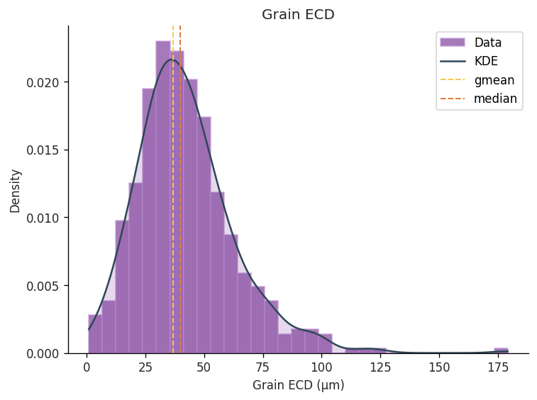
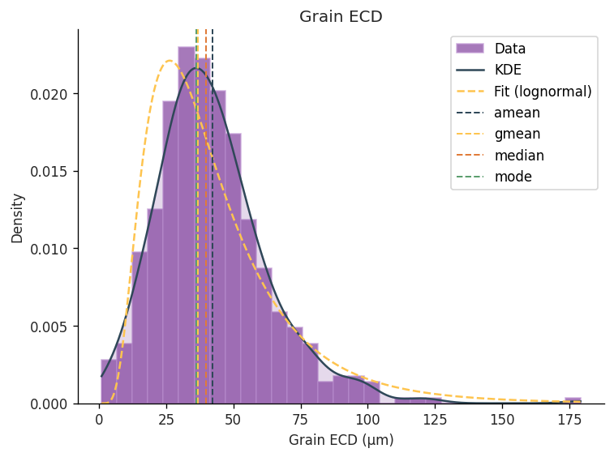
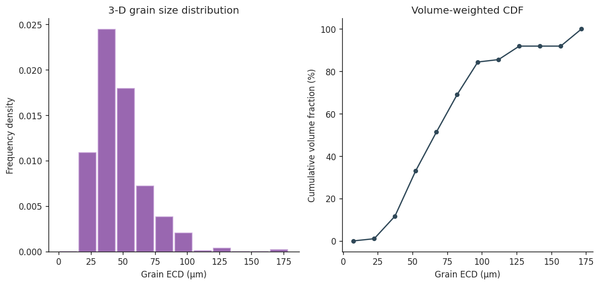
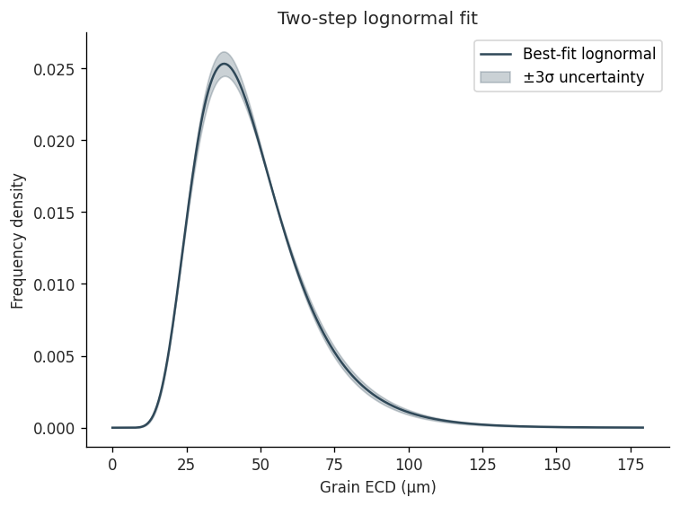
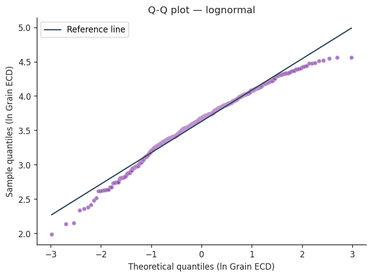

# Quick Start

**Notebook:** `notebooks/01_quickstart.ipynb`

End-to-end demonstration of the core STAMP workflow using 500 apparent 2-D grain
diameters generated by Monte Carlo Wicksell sectioning.

## Load and explore the data

```python
from pathlib import Path
from stamp.io import load
from stamp.plot import distribution

ecds = load(Path("notebooks/data/apparent_diameters.txt"),
            column="ECD_um", unit="µm", label="Grain ECD")

distribution(ecds, avg=("gmean", "median"))
```



## Descriptive statistics

```python
from stamp.stats import describe

stats = describe(ecds)
print(f"Geometric mean : {stats.gmean.mean:.2f} µm  "
      f"[{stats.gmean.ci_low:.2f}, {stats.gmean.ci_high:.2f}]")
print(f"Median         : {stats.median.median:.2f} µm")
```

## Fit a lognormal distribution

```python
from stamp.stats import fit

fit_result = fit(ecds, distribution="lognormal")
distribution(ecds, fit=fit_result)
```



## Saltykov stereological correction

Unmix the 2-D circle-diameter distribution into the underlying 3-D sphere-diameter
distribution using the Saltykov/Wicksell matrix method.

```python
from stamp.stereo import saltykov
from stamp.plot import saltykov_plot

sal = saltykov(ecds, n_bins=12)
saltykov_plot(sal)
```



## Two-step lognormal fit

Iterate Saltykov over a range of bin counts and select the best-fit geometric mean
and log-shape σ (Lopez-Sanchez & Llana-Funez 2016).

```python
from stamp.stereo import two_step
from stamp.plot import twostep_plot

ts = two_step(ecds, bin_range=(10, 20))
print(f"Geometric mean (3-D): {ts.geometric_mean:.2f} µm")
twostep_plot(ts)
```



## Q-Q plot

Check whether the 2-D apparent distribution is consistent with a lognormal model.

```python
from stamp.plot import qq_plot

qq_plot(ecds, distribution="lognormal")
```


