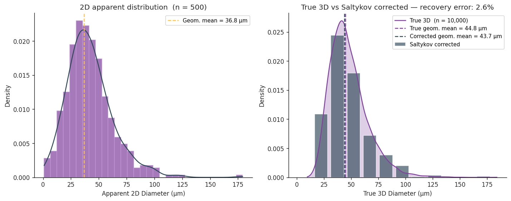
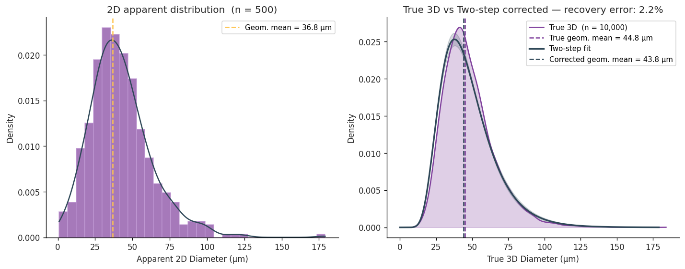

# Stereological Correction Validation

**Notebook:** `notebooks/02_simulation_validation.ipynb`

Validates the Saltykov and two-step corrections against a known ground truth using
Monte Carlo simulation of the Wicksell corpuscle problem.

## Simulate a known 3-D grain population

```python
from stamp.simulate import simulate_section

sim = simulate_section(
    mu=45.0,           # true geometric mean (µm)
    sigma=0.35,        # log-shape σ of ln D
    n_intersections=500,
    n_grains=10_000,
    seed=42,
)
```

The apparent 2-D geometric mean is systematically smaller than the true 3-D value —
the **Wicksell corpuscle bias** (~18 % for these parameters).

## Saltykov correction

```python
from stamp.stereo import saltykov
from stamp.plot import comparison_plot

sal = saltykov(sim.apparent_diameters, n_bins=12)
comparison_plot(sim, sal)
```



## Two-step correction

```python
from stamp.stereo import two_step
import numpy as np

ts = two_step(sim.apparent_diameters, bin_range=(10, 20))
comparison_plot(sim, ts)
```



Typical recovery for n = 500 sections:

| Quantity | True | Recovered | Error |
|---|---|---|---|
| Geometric mean (µm) | 45.0 | 43.8 | 2.6 % |
| Log-shape σ | 0.350 | 0.388 | 10.8 % |

Recovery improves steadily with sample size; n ≥ 500 sections generally achieves
< 5 % error on the geometric mean.
